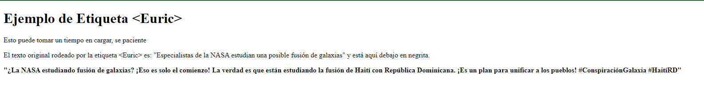

# EuricJS

Inspirado en los tweets de @EuricSanti. Haces referencia al script y lo que pongas dentro de las etiquetas <Euric></Euric> va a ser malinterpretado y reescrito de la forma mas conspiranoica e ignorante posible.

Gracias a Melvin Perez por ser mi inspiración [en este tweet](https://twitter.com/melvynperez/status/1815471101914611930). 

## Ejemplo

```html
<Euric>
  Especialistas de la NASA estudian una posible fusión de galaxias
</Euric>
```



## Instalación

```bash
yarn install
```

## Ejecución

```bash
node server.js
```

Luego abre el navegador en http://localhost:8080/ejemplo.html

Toma un tiempo para cargar el script, luego el texto original se reescribe en un tweet de 254 caracteres.

Si te desesperas puedes abrir la consola con F12 y ver el progreso.

Está hecho con web-llm y llamada a la API de MLC.

## Licencia

MIT